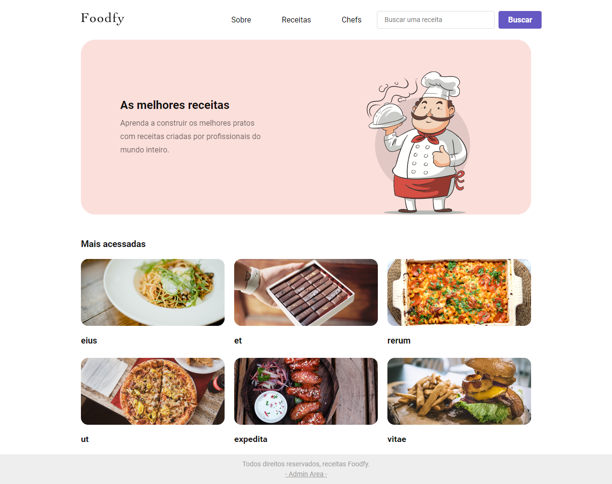

<!-- TITLE -->
<h1>FOODFY</h1> <br>
<div align="center">
  
  
  
<br>

Project developed at the <a href="https://www.rocketseat.com.br/">Rocketseat</a> - BOOTCAMP LAUNCHBASE.
</div><br>  

<!-- 
[![Contributors][contributors-shield]][contributors-url]
[![Forks][forks-shield]][forks-url]
[![Stargazers][stars-shield]][stars-url]
[![Issues][issues-shield]][issues-url] 
-->
[![MIT License][license-shield]](https://github.com/MarioDoncel/LaunchBase/blob/master/LICENSE)
[![LinkedIn][linkedin-shield]](https://www.linkedin.com/in/marioadoncel/)


<br />


<!-- TABLE OF CONTENTS -->
<details>
  <summary>Table of Contents</summary>
  <ol>
    <li>
      <a href="#about-the-project">About The Project</a>
      <ul>
        <li><a href="#built-with">Built With</a></li>
        <li><a href="#objective">Objective</a></li>
        <li><a href="#status">Status</a></li>
      </ul>
    </li>
    <li>
      <a href="#getting-started">Getting Started</a>
      <ul>
        <li><a href="#prerequisites">Prerequisites</a></li>
        <li><a href="#installation">Installation</a></li>
      </ul>
    </li>
    <li><a href="#usage">Usage</a></li>
    <li><a href="#license">License</a></li>
    <li><a href="#contact">Contact</a></li>
    <li><a href="#acknowledgments">Acknowledgments</a></li>
  </ol>
</details>


<!-- ABOUT THE PROJECT -->
## About The Project
An application that stores Recipes from multiples Chefs and Users, project created as a conclusion work to graduate on LAUNCHBASE ROCKETSEAT Bootcamp 
Its a great project where i learned authentication, encrypt passwords, back-end and front-end validation, MVC architeture, upload files, user session, 
sending emails, login and password recovery, SQL queries and a lot of other cool stuff.  

<p align="right">(<a href="#top">back to top</a>)</p>


### Built With

<!-- This section should list any major frameworks/libraries used to bootstrap your project. Leave any add-ons/plugins for the acknowledgements section. Here are a few examples. -->
* HTML
* CSS
* Javascript
* [Node.js](https://nodejs.org/)
* [Nunjucks (template engine)](https://mozilla.github.io/nunjucks/)
* [Express.js (server)](https://expressjs.com/)
* [Express-session](https://www.npmjs.com/package/express-session)
* [PostgreSQL (database)](https://www.postgresql.org/)
* [NodeMailer (emails)](https://nodemailer.com/about/)
* [Multer (upload files)](https://www.npmjs.com/package/multer)
* [Faker (fake data)](https://www.npmjs.com/package/faker)
* [BcryptJS (hash passwords)](https://www.npmjs.com/package/bcryptjs)
* [Method-override (HTTP verbs PUT/DELETE)](https://www.npmjs.com/package/method-override)
* [Connect-Flash (User alerts)](https://www.npmjs.com/package/connect-flash)

<!-- 
* [Next.js](https://nextjs.org/)
* [React.js](https://reactjs.org/)
* [Vue.js](https://vuejs.org/)
* [Angular](https://angular.io/)
* [Svelte](https://svelte.dev/)
* [Laravel](https://laravel.com)
* [Bootstrap](https://getbootstrap.com)
* [JQuery](https://jquery.com)
 -->
<p align="right">(<a href="#top">back to top</a>)</p>

### Objective

Project developed for educacional purposes.
<p align="right">(<a href="#top">back to top</a>)</p>

### Status

Finished.
<p align="right">(<a href="#top">back to top</a>)</p>

<!-- GETTING STARTED -->
## Getting Started

### Prerequisites

<!-- This is an example of how to list things you need to use the software and how to install them. -->
* npm
  ```sh
  npm install npm@latest -g
  ```
* PostgreSQL

### Installation

<!-- _Below is an example of how you can instruct your audience on installing and setting up your app. This template doesn't rely on any external dependencies or services._
 -->

1. Clone the repo
   ```sh
   git clone https://github.com/MarioDoncel/LaunchBase
   ```
2. Install NPM packages
   ```sh
   npm install
   ```
3. Run on PostgreSQL the queries that are in <a href="https://github.com/MarioDoncel/LaunchBase/blob/master/database.sql">database.sql</a> to create a database "foodfy" and all the tables that are necessary.

4. Configure your access to database on  `src/config/db.js`

   ```js
   module.exports = new Pool({
      user: "postgres",
      password: "xxxxxx",
      host:"localhost",
      port: "5432",
      database: "foodfy"
    });
    ```
   
5. If you want to populate your database with fake data to test the application you can run the command
    ```js
    node seed.js
    ```
    
5. Run the application
    ```js
    npm start
    ```

<p align="right">(<a href="#top">back to top</a>)</p>


<!-- USAGE EXAMPLES -->
## Usage

### Public Session

* **HomePage** - Homepage with six highlighted recipes



* **Public About/Recipes/Chefs/SearchResults Pages** - Here you have the pages to the public user. This user can navigate through the recipes, see all the chefs that exists 
on this platform and read the about section
<div style="display:flex;">


</div>
<br>

### Logged Users and Admin Session

* **Admin LogIn/PasswordRecovery/Recipes/Chefs/Users Pages** - Here the logged users can manage their recipes and chefs registereds, also exists an Admin user who has access 
to everything from anyone and make the registered users management
<div style="display:flex;">


</div>
<br>

<p align="right">(<a href="#top">back to top</a>)</p>


<!-- LICENSE -->
## License

Distributed under the MIT License. See `LICENSE.txt` for more information.

<p align="right">(<a href="#top">back to top</a>)</p>


<!-- CONTACT -->
## Contact

Mario Andres Doncel Neto  

Email - 88mario.doncel@gmail.com <br>
Whatsapp - +55 19 99612 9909

Project Link: [https://github.com/MarioDoncel/LaunchBase](https://github.com/MarioDoncel/LaunchBase)

<p align="right">(<a href="#top">back to top</a>)</p>


<!-- ACKNOWLEDGMENTS -->
## Acknowledgments

* [Rocketseat](https://www.rocketseat.com.br/)

<p align="right">(<a href="#top">back to top</a>)</p>


<!-- MARKDOWN LINKS & IMAGES -->
<!-- https://www.markdownguide.org/basic-syntax/#reference-style-links -->
[contributors-shield]: https://img.shields.io/github/contributors/othneildrew/Best-README-Template.svg?style=for-the-badge
[contributors-url]: https://github.com/othneildrew/Best-README-Template/graphs/contributors
[forks-shield]: https://img.shields.io/github/forks/othneildrew/Best-README-Template.svg?style=for-the-badge
[forks-url]: https://github.com/othneildrew/Best-README-Template/network/members
[stars-shield]: https://img.shields.io/github/stars/othneildrew/Best-README-Template.svg?style=for-the-badge
[stars-url]: https://github.com/othneildrew/Best-README-Template/stargazers
[issues-shield]: https://img.shields.io/github/issues/othneildrew/Best-README-Template.svg?style=for-the-badge
[issues-url]: https://github.com/othneildrew/Best-README-Template/issues
[license-shield]: https://img.shields.io/github/license/othneildrew/Best-README-Template.svg?style=for-the-badge
[license-url]: https://github.com/othneildrew/Best-README-Template/blob/master/LICENSE.txt
[linkedin-shield]: https://img.shields.io/badge/-LinkedIn-black.svg?style=for-the-badge&logo=linkedin&colorB=555
[linkedin-url]: https://linkedin.com/in/othneildrew
[product-screenshot]: images/screenshot.png
